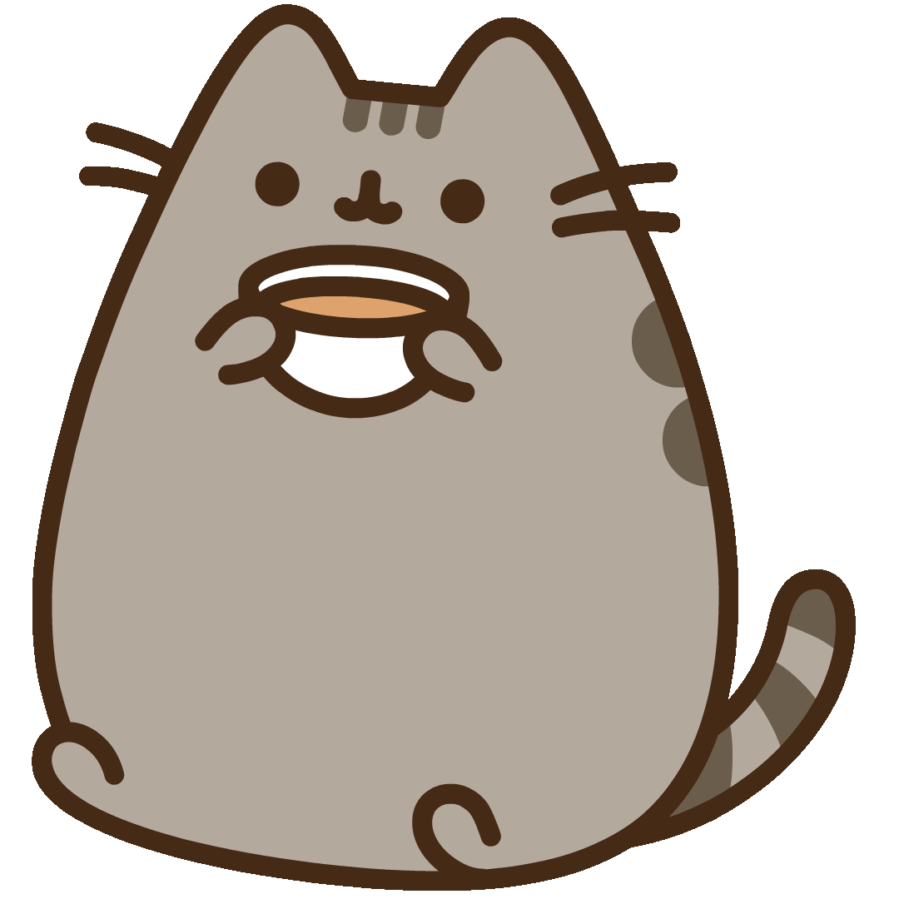

 
Hii. This is my website for myself and anything which intrests me. It is for hobbies, fun and a little bit of projects from UNI. Wish you fun. 

```{r, echo=FALSE, out.width = "90%", out.height = "90%"}

```

